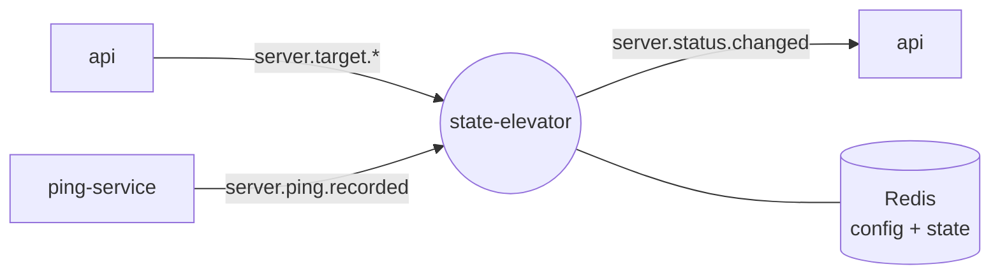

<div align="center">

<a href="https://gitlab.com/pingtower"></a>

# ⚖️ state-elevator

### Turns a stream of raw pings into server status: failure and latency thresholds → `UP` / `DOWN`

[](https://gitlab.com/pingtower/state-elevator/-/pipelines)


<sub>Part of <a href="https://gitlab.com/pingtower"><b>PingTower</b></a> — real-time server availability monitoring</sub>

</div>

---

## Role in the system

A single failed ping is not an outage. state-elevator keeps a small state machine per server, applies the
user's thresholds to every incoming ping and emits an event **only when the status actually changes**.
Everything downstream — the live dashboard, email and Telegram alerts — reacts to those events.



## Features

- **Failure threshold** — the status flips to `DOWN` after `failureThreshold` consecutive failures (default 1); any success resets the counter and sets `UP`.
- **Latency threshold** — a successful ping slower than `latencyThresholdMs` counts as a failure.
- **Change-only events** — `server.status.changed` is published only on a transition (`UNKNOWN → UP`, `UP → DOWN`, …), never on every ping.
- **Self-cleaning state** — runtime state lives in Redis with a TTL of `3 × intervalSec`, so forgotten servers expire on their own; inactive or deleted servers are dropped immediately.
- **Safe consumption** — manual acks; malformed messages are rejected, transient errors are requeued.

## Contracts

| Direction | Channel | Name | Payload |
| --- | --- | --- | --- |
| ⬅️ In | queue ← `serverEventsExchange` | `q.state-elevator.server-events` (`server.target.*`) | server + ping settings → config snapshot |
| ⬅️ In | queue ← `pingEventsExchange` | `q.state-elevator.ping-events` (`server.ping.recorded`) | ping result |
| ➡️ Out | exchange `statusEventsExchange` | `server.status.changed` | `{ "server_id", "status": "UP" \| "DOWN" }` |
| 💾 Storage | Redis (db `1`) | `state-elevator:server-config:{id}`, `state-elevator:server-state:{id}` | thresholds; status + consecutive failures |

Full message schemas: [`infra/rabbitmq/asyncapi.yaml`](https://gitlab.com/pingtower/infra/-/blob/main/rabbitmq/asyncapi.yaml).

## Quick start

**Whole stack** — via [infra](https://gitlab.com/pingtower/infra) (all repos cloned side by side):

```bash
make -C infra up
```

**This service only** (broker and Redis already running from infra):

```bash
cp .env.example .env
docker compose up -d --build
```

**Local development:**

```bash
dotnet run --project src/StateElevatorWorker
dotnet test src/src.sln
```

## Structure

```text
state-elevator/
└── src/
    ├── Domain/                # store and publisher abstractions
    ├── Application/           # StateEvaluation — the status state machine, DTOs, settings
    ├── Infrastructure/        # Redis repository, RabbitMQ status publisher
    ├── StateElevatorWorker/   # hosted worker: consumers for server and ping events
    └── tests/                 # unit and integration tests
```
